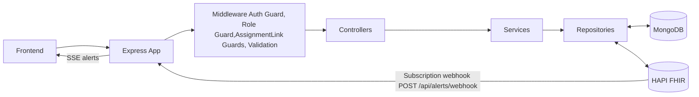
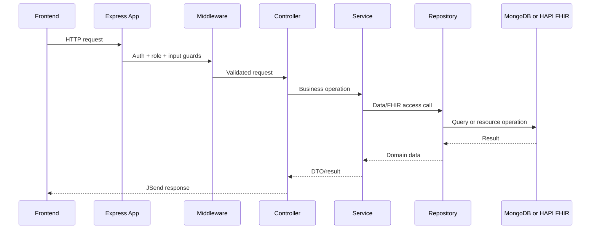
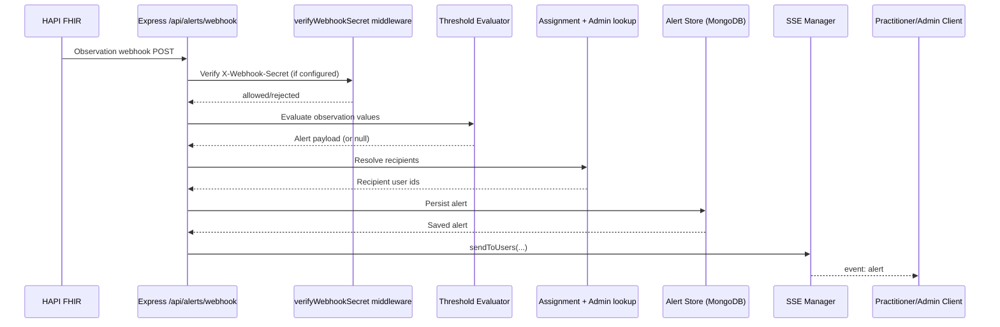

# FHIR MERN

Monorepo for a full-stack FHIR application with a React frontend, an Express backend, and a shared TypeScript package.

Use this README for repo-level setup and workflow.  
Service-specific details live in:

- [`backend/README.md`](./backend/README.md)
- [`frontend/README.md`](./frontend/README.md)

## Architecture Overview



## Request Flow (standard API path)



## Alerting Flow (webhook to SSE)



## Workspaces

- [`frontend/`](./frontend/README.md) - React + Vite client
- [`backend/`](./backend/README.md) - Express API + Better Auth + MongoDB + FHIR integration
- `shared/` - `@fhir-mern/shared` DTO/types package consumed by frontend and backend

## Prerequisites

- Node.js 20+
- npm 9+
- Docker + Docker Compose

## Start Infrastructure

From repo root:

```bash
docker compose up -d
```

Services expected for local development:

- FHIR gateway at `http://localhost:8080/fhir` (nginx proxy to HAPI)
- MongoDB for backend app data
- PostgreSQL for HAPI FHIR

## Install

From repo root:

```bash
npm install
```

This enables Husky hooks for local quality gates.

## Environment Setup

### Backend

```bash
cd backend
cp .env.example .env
```

### Frontend

```bash
cd frontend
cp .env.example .env
```

Set frontend API URL to backend, for example:

```bash
VITE_API_URL=http://localhost:3000
```

## Run Locally

Use separate terminals.

### Backend

```bash
cd backend
npm run dev
```

### Frontend

```bash
cd frontend
npm run dev
```

## Quality Gates

From repo root:

```bash
npm run check:commit
npm run check:push
```

Hook behavior:

- `pre-commit`: `lint-staged` + `npm run check:commit`
- `pre-push`: `npm run check:push`

## Service Test Commands

```bash
cd backend
npm run test:unit
npm run test:integration
npm run test:api
npm test
```

```bash
cd frontend
npm run test
```

## Formatting

From repo root:

```bash
npm run format
```

## API Collection

Postman collection is available at:

- `postman/postman_collection.json`
