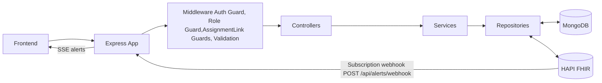
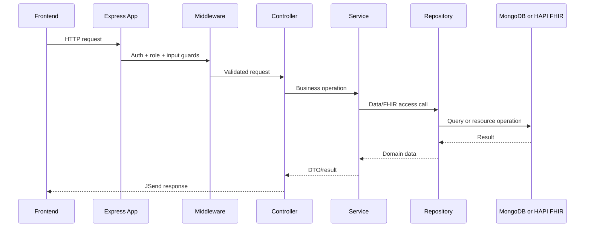
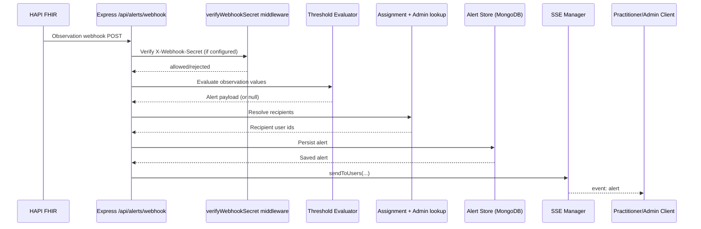

# Backend

Express + TypeScript backend for FHIR MERN. It provides auth, role-based access control, assignment workflows, portal APIs, vitals APIs, and alerting/webhook/SSE support.

This README is backend-specific. For repo-level setup/workflow, use the root `README.md`.

## Stack

- Express 5
- TypeScript
- Better Auth
- MongoDB (Mongoose)
- Zod validation
- HAPI FHIR integration
- Vitest + Supertest testing

## Runtime Responsibilities

- Authenticate users via Better Auth
- Enforce roles (`patient`, `practitioner`, `admin`)
- Link patient users to FHIR Patient records
- Manage practitioner-patient assignments
- Read/write Observation vitals through FHIR
- Evaluate observation thresholds and emit alerts
- Receive FHIR webhook events and fan out SSE alerts

## Architecture Overview



## Request Flow (standard API path)



## Alerting Flow (webhook to SSE)



## API Route Groups

- `GET /` basic health payload
- `/api/auth/*` Better Auth endpoints + `GET /api/auth/me`
- `/api/users/*` admin user management (role updates, patient linking)
- `/api/assignments/*` admin assignment management
- `/api/patients/*` patient search/details/assigned views
- `/api/patients/:id/vitals/*` practitioner/admin vitals routes
- `/api/portal/*` patient self-service portal routes
- `/api/alerts/*` alerts feed, acknowledge, webhook, SSE stream

## Local Setup

### 1) Environment file

```bash
cp .env.example .env
```

Required values are validated at startup (see `src/config/env.ts`), including Mongo URI, FHIR gateway URL + `FHIR_SECRET`, frontend URL, and Better Auth settings.

### 2) Start local infrastructure (from repo root)

```bash
docker compose up -d
```

This starts:

- MongoDB (`app-db`)
- HAPI FHIR + Postgres
- Nginx FHIR gateway at `http://localhost:8080/fhir`

### 3) Start backend

```bash
npm run dev
```

Default local URL: `http://localhost:3000`

## Build & Run

```bash
npm run build
npm start
```

Build output runs from `dist/index.js`.

## Type Checking

```bash
npm run typecheck
```

This builds the shared workspace first, then runs backend `tsc --noEmit`.

## Tests

```bash
npm run test:unit
npm run test:integration
npm run test:api
npm run test:services
npm test
```

Current structure:

- `tests/unit` - isolated unit tests (mocks/stubs)
- `tests/integration` - DB-backed non-HTTP integration tests
- `tests/api` - route-level API tests (including SSE stream coverage)

## Seed FHIR Data (optional)

If you need local sample FHIR resources:

```bash
npx tsx scripts/seed-fhir.ts
```

## Notes

- Auth endpoints expect a valid `Origin` in local testing.
- Webhook route supports optional shared-secret verification via `WEBHOOK_SECRET`.
- FHIR access goes through the local gateway (`FHIR_BASE_URL`) and requires `FHIR_SECRET`.
- Startup bootstraps Mongo and FHIR connectivity with retry loops before server listen.
- SSE stream endpoint is `GET /api/alerts/stream`.

## Troubleshooting

- `401` from `FHIR_BASE_URL`: verify `FHIR_SECRET` matches the gateway secret.
- Auth test failures with CORS/origin checks: verify `FRONTEND_URL` matches test `Origin`.
